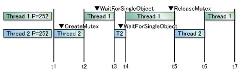
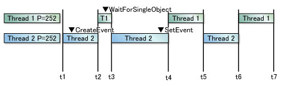

## 2.Windows

有益なサイト
[Windowsの歴史とコア技術情報 - Windowsの核心](https://windows-core.com/)

### Jobを追加した際の必要な作業オプション

* タスクスケジューラを想定
  * 全般でセキュリティーオプション（ログイン時、そうでない時、特権） 
  * トリガーとなるイベントを作成
  * 操作でタスクを作成し、プログラムなどと紐ずける
  * 条件で、アイドル、電源、ネットワークを設定
  * 設定で、タスクの実行条件や再起動間隔、停止するまでの時間n、強制停止するかどうか、などを設定


　定例の作業を自動化できる機能として、Windows OSには「タスクスケジューラ」が標準で装備されている。本稿では、このタスクスケジューラを利用して定期的にプログラム起動を繰り返すための基本的な設定手順を説明する。

　例として挙げるのは、毎日決まった時刻に特定フォルダをファイルサーバへバックアップする、というものだ。プログラムを差し替えれば、バックアップ以外のタスクも同様の手順で作成できる。

　ただ、タスクで実行されるプログラムは設定を変更しない限り、ログオン（サインイン）中のユーザーアカウントの権限で起動される。そのため、対象のプログラムが正しく実行できる権限を持ったユーザーアカウントであらかじめWindowsにサインインしてから、以下の作業を進めていただきたい。タスク自体は、管理者アカウントではなく一般ユーザーの権限でも作成できる。
タスクスケジューラの設定画面を開く

　タスクスケジューラの設定をするには、スタートメニュー／スタート画面／Cortana（コルタナ）の検索窓に「タスク」と入力して、見つかった「タスク スケジューラ」または「タスクのスケジュール」をクリックする。

　あるいは、コントロールパネルの［システムとセキュリティ］－［管理ツール］をクリックし、［タスク スケジューラ］をダブルクリックする。コントロールパネルを開くには、スタートメニューなどで「control」と検索すれば見つかる。

Ref)
[タスクスケジューラの基本的な使い方](http://www.atmarkit.co.jp/ait/articles/1305/31/news049.html)


---
### 通常プロセスとサービスの違いの詳細説明
| 説明             | サービス                                                                                                                                            | プロセス                                                                                                                      |
|------------------|-----------------------------------------------------------------------------------------------------------------------------------------------------|-------------------------------------------------------------------------------------------------------------------------------|
| 概要             | ユーザ（ネットワーク経由を含む）に対して(サービス)をする仕組みのようなもの。実態はプロセス。                                                    | OS上で動く単位。原則としてプロセスとして同じ名前のexeファイルがある。さらにプロセスから最小単位であるスレッドから起動される。 |
| 例               | Oracleサービス、IISサービス、FTPサービス、リモートデスクトップサービス、Postfixサービス                                                             | Wordのプロセス（WINWORD.EXE）、Excel のプロセス（EXCEL.EXE）、サービスのプロセス（svchost.exe）                               |
| ユーザログオフ時 | そのまま継続して起動する。                                                                                                                          | ユーザが起動したアプリケーションのプロセスはログオフ時に自動で終了する。                                                      |
| 管理             | SCM(Service Control Manager[^1]、サービスコントロールマネージャー)により管理されている。SCMの指示によりサービスが起動したり停止したり再起動したりする） | OSにより管理される。                                                                                                          |
| 操作             | SCMの指示により動作する。                                                                                                                           | 主にユーザのキーボード入力などにより操作される。                                                                              |
| 画面             | 原則、画面(GUI)は持たない。                                                                                                                         | 通常は画面(GUI)を持つが、持たないプロセスも多い。                                                                             |

追加で勉強）
 [サービスコントロールマネージャー（services.exe）とは - Windowsの核心](https://windows-core.com/windows_feature/feature-24.php)

---
### RDPに接続できなくなった理由を全て列挙


1. Windowsファイヤーウォール
 リモートデスクトップが接続出来ない時は大部分がWindowsファイヤーウォールに遮断されています。
ファイヤーウォールの設定を確認しましょう。
左下のWindowsマークを右クリックして「コントロールパネル」→「システムとセキュリティ」→「Windowsファイヤーウォール」→「詳細設定」を選択。
2. リモートデスクトップが許可されているか
 Windowsファイヤーウォールの設定が問題ないのにリモートデスクトップが接続出来ない場合、そもそもホストのリモートデスクトップ自体が許可されていない可能性があります。
リモートデスクトップの有効/無効の確認と、無効の場合は有効へ設定変更する。
左下のWindowsマークを右クリックして「システム」、「リモートの設定」をクリック。
3. 接続が許可されたユーザーか
 そのホストに接続が許可されたユーザーではない可能性があります。
基本的にドメイン管理者やホスト側端末の管理者権限がある場合はこれらの設定は不要ですが、管理権限が無いユーザーでホスト端末へリモートデスクトップする場合はホストごとに許可ユーザーに追加する必要があります。
* 前の「ホストPCのリモートデスクトップ許可」と同じ画面までいき、「ユーザーの選択」をクリックします。

* 3389ポート(接続ポート) 確認
* サーバとクライアントのOSパッチ適用レベルの問題がないか

> 「認証エラーが発生しました。要求された関数はサポートされていません」
 「リモートコンピューター：原因はCredSSP暗号化オラクルの修復である可能性があります」
クライアントPCで、ローカルグル―プポリシーエディタを起動します。
`スタートからgpedit.msc`


---
### Active Directoryユーザー情報のサブセットとグループメンバーシップ情報
Skip
レプリケーションに関する情報が出てくる。


---
### グループポリシー ドメインレベルのアカウントポリシー パスワードポリシー
Active Directoryでは、ユーザーの最短パスワード長や、同じパスワードを使い続けられる日数、パスワードをたて続けに間違えて入力した場合にそのアカウントを一時的にロックするための設定など、パスワードにかかわるさまざまな設定をドメインユーザーに対して強制することができます。
これらの **ユーザーのパスワードにかかわる設定を「アカウントポリシー」** といいます。

アカウントポリシーを設定する方法には、次の3つがあります。

1. すべてのドメインユーザーに適用する（ドメインのグループポリシー）
  ドメインユーザー全員に対する共通のアカウントポリシーを設定します。
2. 一部のドメインユーザーに適用する（FGPP[^FGPP]）
  ドメインユーザー全員に対する共通のアカウントポリシーを設定します。
3. リモートアクセスやRADIUSサーバーで認証される時だけ適用する（レジストリの直接変更）
  ドメインユーザー全員に対する共通のアカウントポリシーを設定します。

たとえば、「1」ですべてのユーザーに対するポリシーを設定し、管理者や管理職など一部のユーザーに対して一般社員よりも厳しいパスワード要件を「2」で適用する、などの使い方ができます。

> ダイヤルアップやリモートアクセスVPNなどの、ネットワークアクセスサーバー経由の認証や、RADIUSサーバーを経由した認証が行われた時だけ適用されます。
通常のWindowsログオン時には適用されません。

[^FGPP]: Fine-Grained Password Policy

Links)
[Active Directory ドメインユーザーのアカウントポリシー｜人材育成・研修のエディフィストラーニング](https://www.edifist.co.jp/lecture/network/password_policy/index.aspx)

---
### ドメイン環境でのアカウントポリシー

GPO = Group Policy Object

| 優先順位 | GPO設定                                        |
|----------|------------------------------------------------|
| 1        | OU（OUが階層構造になっている場合は子OUを優先） |
| 2        | ドメイン                                       |
| 3        | サイト                                         |

パスワードポリシーの優先順位

　グループポリシーの設定はここまで説明した通り、優先順位（OU、ドメイン、サイトの順）で適用される。しかし、**GPOの「パスワードポリシー」だけは、“ドメイン”にリンクされたGPOの設定が必ず適用される。そのため、OUにリンクされているGPOにパスワードポリシーを設定しても、適用されないので注意しよう。** なお、既定ではDefault Domain Policy GPOがドメインにリンクされており、このパスワードポリシーの設定が適用されている。

Links)
[グループポリシーの仕組み、理解できていますか？](http://www.atmarkit.co.jp/ait/articles/1501/29/news032.html)
 
---
### Windowsのサービスで使用される「System(Local System)」「Local Service」「Network Service」アカウント
* Windows OSがサービスを起動するための専用アカウントとして提供しているもの。
* サービスは特殊な権限を必要とすることが多いため、通常のユーザー・アカウントではなく、これらのサービス用アカウントがデフォルトでサービス起動に利用される。
**いずれもOSによってインストール時に自動作成されるビルトイン・アカウント**

| 名称                               | System（Local System）                                    | Local Service                     | Network Service                                           |
|------------------------------------|-----------------------------------------------------------|-----------------------------------|-----------------------------------------------------------|
| 名称（日本語）                     | システム （ローカル システム）                            | ローカル サービス                 | ネットワーク サービス                                     |
| アカウントの実際の名前             | NT AUTHORITY/System                                       | NT AUTHORITY/LocalService         | NT AUTHORITY/NetworkService                               |
| 権限                               | Administratorsグループのメンバと同じレベル                | Usersグループのメンバと同じレベル | Usersグループのメンバと同じレベル                         |
| ネットワーク・アクセス時の資格情報 | ローカルのコンピュータ・アカウント（＜コンピュータ名＞$） | 匿名                              | ローカルのコンピュータ・アカウント（＜コンピュータ名＞$） |

#### System（システムまたはローカル システム）アカウント
　SystemはAdministratorsグループのメンバと同等の権限を持つアカウントで、システムへのフル・アクセスが可能だ。ネットワーク・リソース（ネットワークを経由して利用するリソース）にも、ローカルのコンピュータ・アカウントの資格情報でアクセスできることから、Active Directoryのディレクトリ・サービスなどネットワーク系のサービスにも多用されている。ドメイン・コントローラ上でSystemによって起動されたサービスは、そのドメイン全体にアクセスできる。

　このようにSystemは強力な権限を持つため、攻撃者にサービスの脆弱性を突かれて乗っ取られた際、被害が甚大になりかねない。そこで**Windows XPから、権限の制限されたサービス用アカウントとして次の2つが新設された。**

#### Local Service（ローカル サービス）アカウント
　Local ServiceはUsersグループのメンバと同じ権限しか持たないサービス用アカウントだ。ネットワーク・リソースへのアクセスも、特定アカウントではなく匿名の資格情報に制限される。デフォルトでは、ローカルとネットワークのどちらのリソースに対しても、Systemほど強力な権限を必要としないサービスで利用されている。

#### Network Service（ネットワーク サービス）アカウント
　Local Serviceと同じく、Usersグループのメンバと同じ権限しか持たないサービス用アカウント。ただしネットワーク・リソースには、Systemと同じくローカルのコンピュータ・アカウントの資格情報でアクセスできることから、Systemほど強力な権限を必要としないネットワーク系サービスで利用されている。

Ref)
[Windowsのサービスで使用される「System」「Local Service」「Network Service」アカウントとは？](http://www.atmarkit.co.jp/ait/articles/0905/08/news095.html)

---

### クリティカルセクション ミューテックス イベント セマフォの違い

**共有リソースの排他制御**
* プロセス内の排他制御はクリティカルセクション
* OSリソース、デバイスの排他制御はミューティックス、セマフォ
  * ミューテックスとはMutual Exclusion（相互排除）を略してMutexとしたもの
  * セマフォは手旗信号という意味で、処理の要求と処理の解放を手旗信号のように相互に知らせ合いながら排他制御を行う
* 割り込みの通知はイベント


#### プロセス内の排他制御はクリティカルセクション
* スレッドの実行順をスケジューリング（CPU実行権限の割り振り）するのは、カーネルのスケジューラ
* 他のスレッドに実行権限が渡されると、実行中のスレッドの処理は中断されます。

そのタイミングは、他の優先順位の高いスレッドの状態やクァンタムの値に従ってスケジューラが制御します。

* 他のスレッドに処理を中断されるのを防ぎたいケース
 たとえば、時間に制限のあるハードウェアアクセスや共有メモリへのアクセスなどの場合です。こうした中断を防ぎたい場合に利用する同期オブジェクトの1つとして、クリティカルセクションがあります。

　クリティカルセクションを利用したコード例と図は、次のようになります。

```
　CRITICAL_SECTION MyCritSec;
　InitializeCriticalSection(&MyCritSec);
　EnterCriticalSection(&MyCritSec);

　…中断されるのを防ぎたい処理

　LeaveCriticalSection(&MyCritSec);
　DeleteCriticalSection(&MyCritSec);
```


　EnterCriticalSectionとLeaveCriticalSectionで囲まれた部分がクリティカルセクションです。ここが中断を防ぎたい部分になります。図1では、Thread2のt3～t6がこれに相当します。EnterCriticalSectionでクリティカルセクションに入り、LeaveCriticalSectionで クリティカルセクションを解放しますが、**その間は1つのスレッド（ここではThread2）だけがCPUの使用権を持ち、他のスレッドは実行できません。つまり排他処理が行われます。クリティカルセクションで排他制御を行うのは、1つのプロセス内のスレッド間です。**
 
 
#### より複雑な排他制御にはミューテックスやセマフォ

　ミューテックスも、共有リソースの排他制御に利用できる同期オブジェクトです。ミューテックスはクリティカルセクションと似ていますが、 **任意の名前を設定できてカーネルオブジェクトとして管理されるため、OS上のすべてのスレッドに対して排他制御を行うことができます。**

　以下に示したサンプルコードのように、まずCreateMutexというAPIを使ってミューテックスオブジェクトのハンドルhMutexを生成します。このハンドルを使い、WaitForSingleObjectまたはWaitForMultipleObjectを利用して排他制御を行います。

　このコードと図2で示したのは、Thread1とThread2がミューテックスを利用して排他制御を行っている様子です。たとえばThread1がWaitForSingleObjectから復帰した場合、Thread1がこのミューテックス（hMutex）のオーナーとなります。Thread2は、Thread1がミューテックスのオーナー権を解放（ReleaseMutex）するまでWaitForSingleObjectから復帰できません。Thread1がReleaseMutexを呼び出してオーナー権を解放すると、Thread2がWaitForSingleObjectから復帰して、今度はThread2がミューテックのオーナーとなります。

```
　// 初期化処理
　HANDLE hMutex;
　hMutex = CreateMutex(NULL, FALSE, NULL);

```

```
　//Thread 1
　WaitForSingleObject(hMutex, INFINITE);

　…排他対象の処理


　ReleaseMutex(hMutex);
```

```
　//Thread 2
　WaitForSingleObject(hMutex, INFINITE);

　…排他対象の処理

　ReleaseMutex(hMutex);

```


 また、セマフォも排他制御に利用する同期オブジェクトです。実装はミューテックスに似ていますが、**ミューテックスとは異なり複数のスレッドがオブジェクトにアクセスできる。** 
> セマフォは排他対象に対する同時アクセス数の上限を管理する使い方ができます。カウンタの付いたミューテックスと言えばわかりやすいでしょう。

　ミューテックスとはMutual Exclusion（相互排除）を略してMutexとしたものです。またセマフォは手旗信号という意味で、処理の要求と処理の解放を手旗信号のように相互に知らせ合いながら排他制御を行うことに由来しています。

学習）任意の名前

#### 割り込みの通知はイベント
 **スレッド間でタイミングを通知するときに利用する同期オブジェクトがイベント** 
 イベントを利用すると、ある事象が発生したことを他のスレッドに伝えることができます。

 あるスレッドが事象の発生を伝えたい場合は、SetEventを呼び出します。このAPIを呼び出すと、指定したイベントオブジェクトがシグナル状態になります。一方、事象の発生を待つ側のスレッドは、WaitForSingleObjectまたはWaitForMultipleObjectを呼び出します。これらのAPIを呼び出したスレッドは、イベントオブジェクトがシグナル状態になるまでブロック状態のままです。

　ひとたびイベントオブジェクトがシグナル状態になると、WaitForSingleObjectまたはWaitForMultipleObjectを呼び出したスレッドのブロック状態が解除され、実行可能状態になります。この様子を示したのが図3です。Tread1は事象の発生を待つ側で、WaitForSingleObjectを呼び出しています。事象の発生を伝える側のThread2でSetEventを呼び出すと、Tread1は実行可能状態になります。

　組み込み機器では、ハードウェアからの割り込みをデバイスドライバにすばやく通知すしなければならない場面がよくあります。そのような時にイベントを利用します。

　組み込み機器の複雑なマルチタスク処理の裏では、以上のようなオブジェクトがスレッドの同期をコントロールしながらリアルタイム性を実現しています。 

